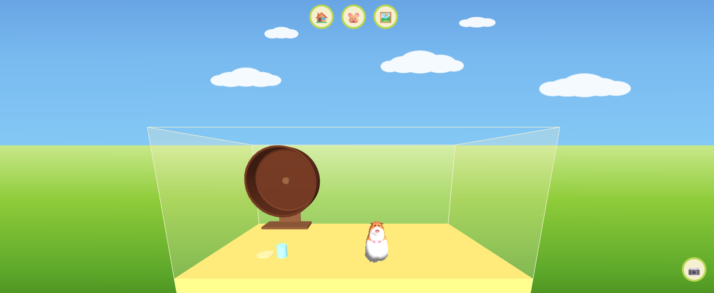

# 🐹 Neckster

거북목이 될수록 목이 늘어나는 햄스터 Chrome 확장 프로그램



## 📌 소개

**Neckster**는 장시간 웹서핑하는 동안 점점 '거북목'이 되는 모습을 재미있게 시각화하는 Chrome 확장 프로그램입니다. 모든 웹페이지에서 귀여운 3D 햄스터가 화면에 나타나 시간이 지날수록 목이 길어집니다.

## ✨ 주요 기능

### 모든 웹페이지
- **목 늘어나는 애니메이션**: 30초마다 목이 0.1씩 길어집니다
- **거북목 자세**: 목이 길어질수록 햄스터가 앞으로 구부러지는 거북목 자세를 취합니다
- **클릭 상호작용**: 햄스터를 클릭하면 찌그러졌다 돌아오며 하트 이모지가 떠오릅니다 ❤️
- **드래그 이동**: 햄스터를 잡아 화면 왼쪽/중앙/오른쪽 원하는 위치로 이동할 수 있습니다
- **크기 조절**: 햄스터 위에서 우클릭하면 크기 슬라이더가 나타납니다 (0.3x ~ 2.0x)
- **자동 걷기**: 5~10초 주기로 드래그한 구역 안에서 자동으로 왔다 갔다 합니다
- **생생한 호흡**: 살아있는 느낌을 주는 호흡 애니메이션
- **시간 추적**: 백그라운드에서 누적된 시간을 기록합니다

### 새 탭 페이지
- **3D 햄스터 케이지**: 새 탭을 열면 하늘 배경과 3D 케이지가 펼쳐집니다
- **케이지 위치 변경**: 🏠 버튼으로 케이지를 왼쪽 / 오른쪽 / 전체 화면으로 전환합니다
- **크기 조절**: 🐹 버튼으로 햄스터 크기를 슬라이더로 조절합니다
- **인테리어 꾸미기**: 🖼️ 버튼으로 쳇바퀴 · 밥그릇 · 물병을 케이지 안 원하는 위치에 배치합니다
- **스크린샷**: 📷 버튼으로 배경과 케이지를 합성한 이미지를 저장합니다

## 🎯 기술 스택

- **Three.js**: 3D 렌더링 엔진
- **GLTFLoader**: 3D 모델 로딩
- **Chrome Extension Manifest V3**: 확장 프로그램 기반

## 🚀 설치 방법

1. 이 저장소를 클론하거나 다운로드합니다
   ```bash
   git clone <repository-url>
   ```

2. Chrome 브라우저를 엽니다

3. 주소창에 `chrome://extensions/`를 입력합니다

4. 우측 상단의 **개발자 모드**를 켭니다

5. **확장 프로그램 압축해제 로드** 버튼을 클릭합니다

6. 이 프로젝트의 폴더를 선택합니다

7. Neckster 확장 프로그램이 설치됩니다! 🎉

## 📁 프로젝트 구조

```
neckster/
├── manifest.json         # 확장 프로그램 설정
├── content.js            # 모든 페이지 햄스터 오버레이 (3D 렌더링, 드래그, 크기 조절)
├── background.js         # 백그라운드 스크립트 (시간 추적)
├── newtab.html           # 새 탭 페이지
├── newtab.js             # 새 탭 케이지 씬 (인터랙션, 인테리어)
├── newtab.css            # 새 탭 UI 스타일
├── assets/
│   ├── hamster.glb       # 3D 햄스터 모델
│   └── wheel.glb         # 3D 쳇바퀴 모델
├── libs/
│   ├── three.min.js      # Three.js 라이브러리
│   └── GLTFLoader.js     # GLTF 모델 로더
├── icons/
│   ├── icon16.png
│   ├── icon48.png
│   └── icon128.png
└── README.md
```

## 🎮 사용 방법

### 웹 브라우징 중
1. 모든 페이지 우측 하단에 햄스터가 자동으로 나타납니다
2. **클릭**: 하트 이모지와 함께 찌그러졌다가 돌아오는 애니메이션 재생
3. **드래그**: 햄스터를 잡아 화면 왼쪽/중앙/오른쪽으로 이동 → 놓으면 그 구역 안에서 자동으로 걷습니다
4. **우클릭**: 크기 슬라이더 팝업으로 크기 조절

### 새 탭에서
1. 새 탭을 열면 하늘·잔디 배경과 케이지가 나타납니다
2. **🏠**: 케이지를 전체/왼쪽/오른쪽으로 전환
3. **🐹**: 크기 슬라이더
4. **🖼️**: 쳇바퀴·밥그릇·물병을 클릭 후 케이지 안에 배치
5. **📷**: 현재 화면을 이미지로 저장

## 🔧 개발 정보

### 핵심 애니메이션

- **목 늘어나기**: Neck 본의 scale.y 증가 (최대 3배)
- **거북목 각도**: Head·Neck의 rotation.x 조정
- **호흡**: 전체 모델 scale을 사인파로 변동
- **걷기**: 다리 본 rotation + 좌우 이동, 드래그한 구역 내 경계 반사

## 🐛 알려진 문제

- 일부 무거운 웹페이지에서 성능 저하가 있을 수 있습니다
- iframe 내부의 콘텐츠에는 햄스터가 나타나지 않습니다

## 📝 라이센스

MIT License

## 🎨 크레딧

3D 햄스터 모델: "Hamster" by alis_v_v on Sketchfab
Licensed under CC BY 4.0
https://skfb.ly/o6G9P

## 👨‍💻 기여

버그 리포트와 기능 제안은 언제나 환영합니다!

---

**당신의 목을 건강하게 지키세요! 🦴✨**
